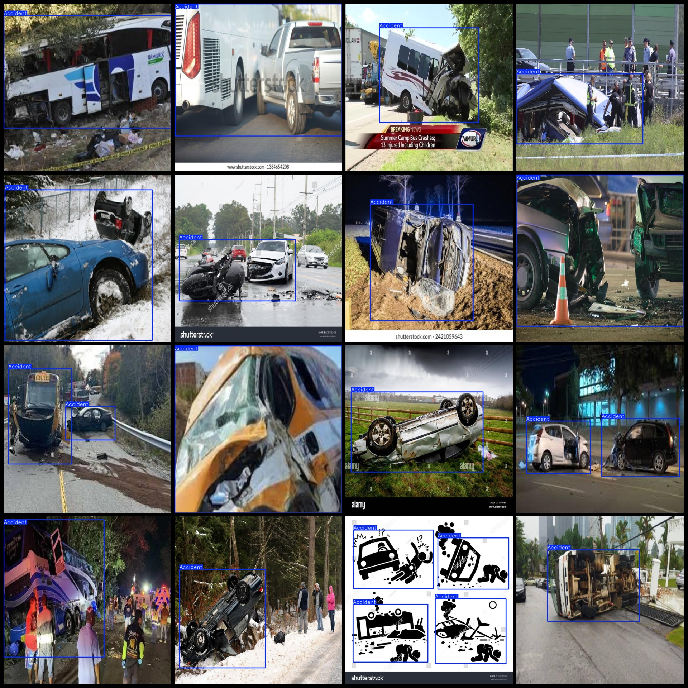
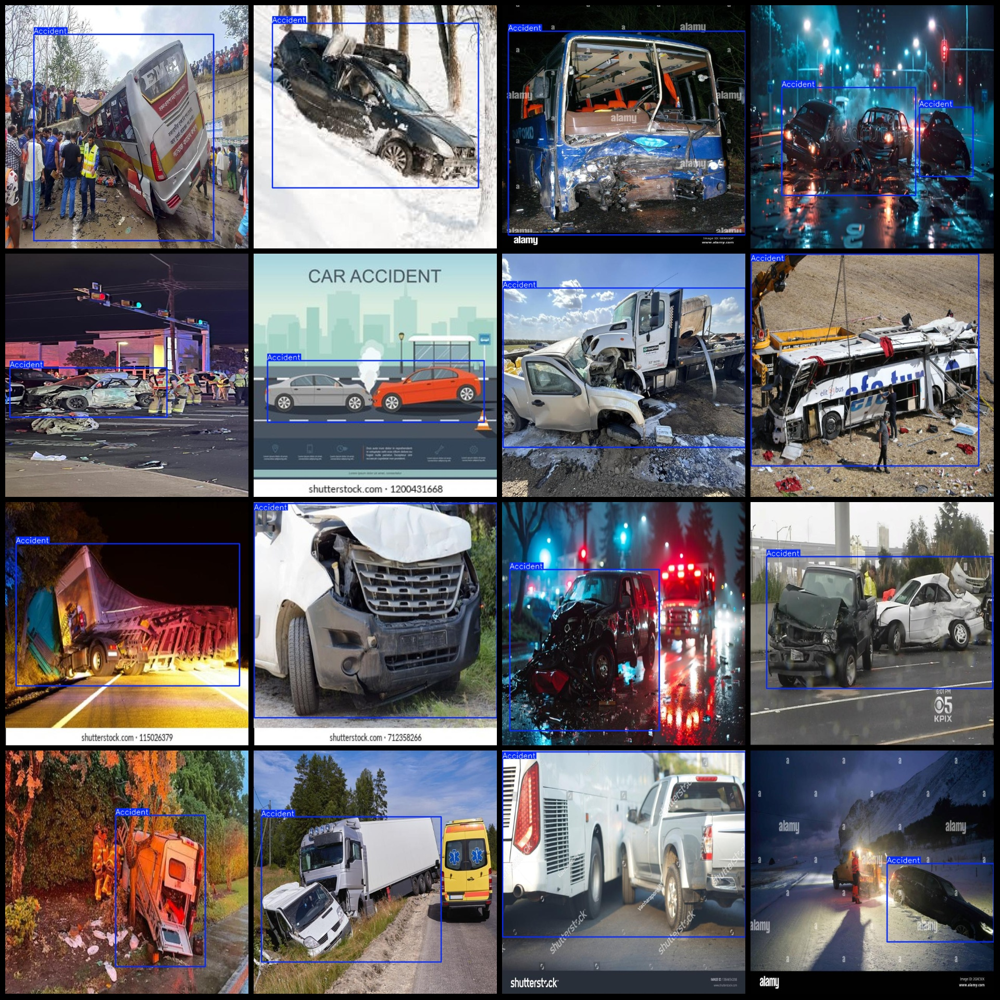

# Smart Traffic Road Accident Detection Dataset: Pascal VOC + YOLO Format (1751 Categories)

Dataset format: Pascal VOC format + YOLO format (excluding split paths in the txt file, consisting only of jpg images and corresponding VOC format xml files and YOLO format txt files).
Number of images (jpg file count): 1751
Number of annotations (xml file count): 1751
Number of annotations (txt file count): 1751
Number of annotation categories: 1
Annotation category name: ["Accident"]
Number of bounding boxes per category:
- Accident = 1955
Total number of bounding boxes: 1955
Number of images per category:
- Accident = 1751
Image resolution: 640x640
Annotation tool used: labelImg
Annotation rules: Draw a rectangle around the category
Important notice: The dataset does not have a division into training/validation/test sets, and users need to manually divide them.
Special declaration: This dataset does not guarantee the accuracy of the trained models or weight files.
Image preview:
Annotation example:

## Images

Here is a pay link on Stripe ( https://buy.stripe.com/3cs8yP7sY87d0vu9AB ). Please contact me lonlonago@foxmail.com after funding $89, and I will send you a complete data files , thank you!

